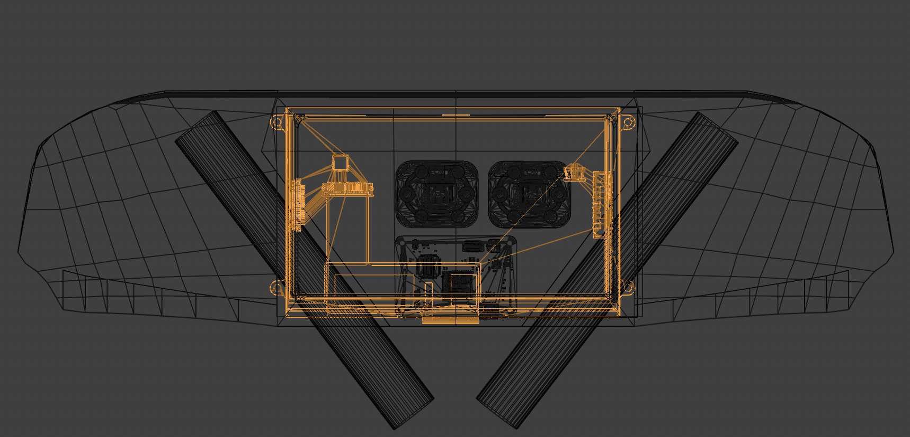
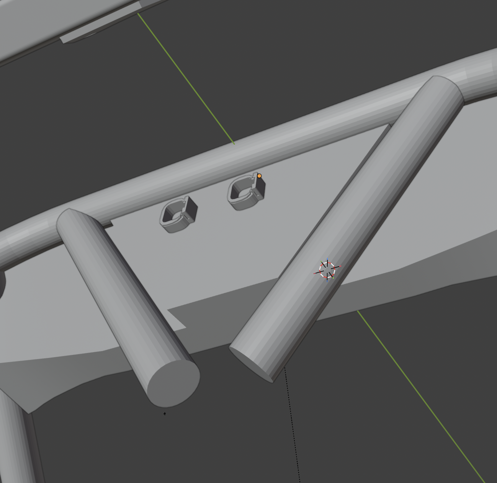
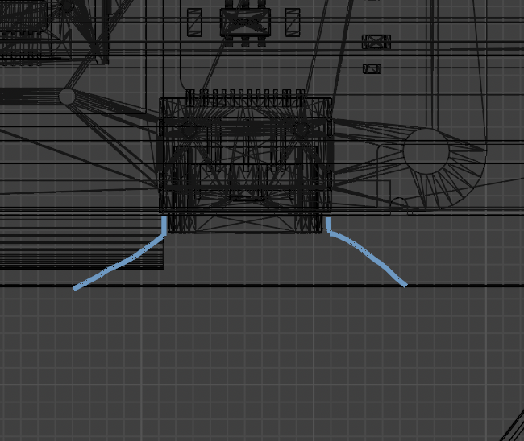
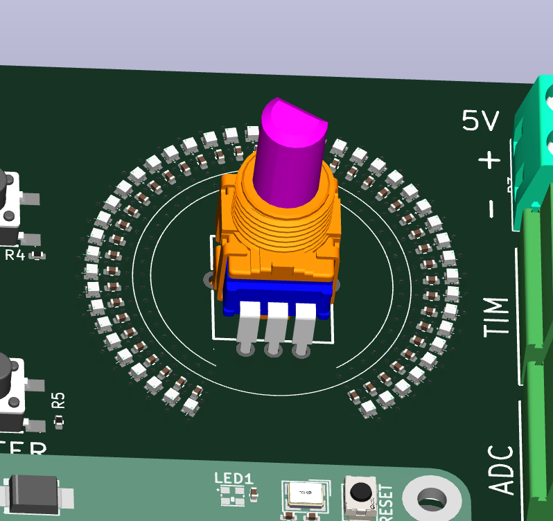

# Dashboard & Steering Wheel

## Enclosure material
- SLA resin printing makes sense in a lot of ways: easy to design, free flowing shapes, durable, looks good. Main watch-outs are weight and possible need for cooling.
- Material just needs high dimensional stability and to be UV, heat deflection, and water resistant. Tough 1500 from Formlabs is one example, there are plenty of others and the design reqs are similar across most, so this doesn't need to be locked in until closer to prod.
  - Reaching out to print-on-demand companies (Xometry, Formlabs, Protolabs, etc.) for a manufacturing sponsorship. The field is crowded enough that landing one for free or a big discount is realistic.
- FDM only as an absolute worst-case fallback (and for the first prototype to validate the design).
- Open to better ideas otherwise.

## Enclosure assembly
- Both dash and steering wheel probably make most sense as two parts, front and back.
- Securing the halves together is an open question:
  - Brass inserts in the front piece + machine screws through the back would be cleanest, but most resins aren't thermoplastics so epoxy-bonded inserts could be a regrettable mess.
  - Wafer-top machine screws from the front with a counterbore + barrel nuts from the back is probably strongest, keeps wall thickness pretty even, and looks alright.

## Dashboard

### Components
- **Dash PCB & Display Step:** https://github.com/NYU-Formula-SAE-Electronics/Dash-PCB/blob/main/dash-pcb.step
  - It will give a 404 error if you're in the Github Org, make an account and dm username to Sasha or Veikko for inviting you.
  - As of June 17th the core pcb's 3d model needs usbc and sd adapter position corrected in cad
- **Buttons** left, right, up, down, okay, back (FLM8-BJ-1-XX000-A10M2)
  - Datasheet: https://www.indicatorlight.com/wp-content/uploads/2021/11/8mm-waterproof-IP65-momentary-mini-push-button-switch.pdf
  - labeling is an open question
- **Ready to drive button:** https://www.te.com/en/product-2213775-7.html
- **2 x Panel mount LED:** being finalized
- **2 x 4 pin connectors** mounted on the back near horizontal center (already in dash pcb 3D-model)

### Design
- Needs to flow well with chassis and body panels
- Minimal height as display is already pretty big, wall thickness can be slightly reduced there to minimize height

  

- Thicker section at the center back to accomodate for connectors

  

- Otherwise minimal thickness except for when interfacing with the chassis
- 2 mm wall thickness with optimized ribs 
- 3 mm clearance from chassis tubes on average to allow for vibration insulation (also how close is actual chassis to cad?)
- Lip above display for sun shading
- Display Nav buttons on the right side of display 
- IMD & AMS leds, BRB, RTDB on the left side of display 
  - Open to different arrangements on these, LEDs can conceivably be on the right side too.
- Opening on under side for USB-C port (preferably with guiding funnel)

  

### Construction preliminary (in-order front to back)
1. Buttons & Panel-mount Leds
2. Front enclosure cover
3. 1/16 inch clear acrylic sheet in front of display
4. Display
5. Dash PCB assembly
6. Back enclosure cover
7. Bobbins or other vibration isolation

### Mounting
- Vibration resistance: Rubber bobbins maybe, or rubber washers/sheets like the pcu last season (that was pretty janky though).
- Steering wheel can use the existing quick-release mechanism, but dash integration is tougher. The plan this season is to redo the front panels into one uniform piece? Worth figuring out how much of that cad can happen in parallel with the dash or accomodate for the dash so they end up fitting together smoothly.

## Steering Wheel

PCB repo and 3d model are ~1-2 months out. Components are selected so CAD is mostly not blocked.

### Components
- **Knob potentiometer:** https://github.com/NYU-Formula-SAE-Electronics/fsae-kicad-lib/blob/main/fsae.3dshapes/RK09L1140-F15.STEP
- **Connector** (placed on backside under steering column): https://github.com/NYU-Formula-SAE-Electronics/fsae-kicad-lib/blob/main/fsae.3dshapes/ATM15-4P-BM03.stp
- **Buttons**
  - same as dash 3x on both sides reachable with thumbs (labeling open question)
  - probably too tall to mount on pcb but can be soldered by wire to pads on the edge of pcb
- **PCB** will be 1.6mm thick (can also use 1.2mm if in a squeeze)

### Leds
- Surface mounted arrays on pcb for both logo and arcs around potentiometers to show position
- Transclucent diffuser in front (resin printed, glued from inside)

  

### Construction preliminary (in-order front to back)
1. Knob covers & buttons
2. Front enclosure cover
3. Translucent inserts for leds and ambient light sensor
4. PCB
5. Thermal paste
6. 1/8 inch (or other) aluminum plate (PCB heatsink and added structural support)
7. Back enclosure cover (needs to expose the aluminum plate to as much of an extent as possible)
8. Vibration isolation, rubber washers or smth
9. Quick-release adapter
