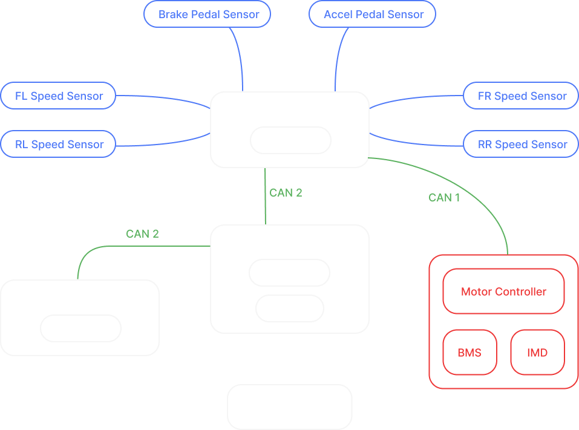

# Gen 2 System Architecture

### Project 1: STM32 Core (Hydra)
- [STM32G474RET6](https://jlcpcb.com/partdetail/STMicroelectronics-STM32G474RET6/C521608)
    - 170MHz, 512KB flash, 128kB RAM, ARM Cortex-M4F, all peripherals we could possibly need
- CAN Transceivers
    - Protection
    - Termination jumper / switch
- Oscillator
- 3V3 (and 5V) Power + Protection
    - 12V to 5V Conversion: [LMR33620BQRNXTQ1](https://jlcpcb.com/partdetail/TexasInstruments-LMR33620BQRNXTQ1/C2071065) (2A buck)
        - [Datasheet](https://www.ti.com/lit/ds/symlink/lmr33620-q1.pdf)
    - 5V to 3V3 Conversion: [TLV76733QWDRBRQ1](https://jlcpcb.com/partdetail/TexasInstruments-TLV76733QWDRBRQ1/C5220143) (LDO)
- SWD header (Tag-Connect TC2030 footprint — pads only, for first-flash + bricked-bootloader recovery without opening enclosures)
- SD-Adapter
- Status LEDs
- Reset and bootmode control (NRST button, BOOT0 pulldown + recovery button — only used until app bootloader is on the chip)
- USB-C 
- Power MUX
    - [TPS2121](https://jlcpcb.com/partdetail/TexasInstruments-TPS2121RUXR/C485916)
- Board-to-Board connectors
    - [Plug - Underside of this board](https://jlcpcb.com/partdetail/PANASONIC-AXK530147YG/C6508367)
    - [Socket - Topside of carrier boards](https://jlcpcb.com/partdetail/PANASONIC-AXK630347YG/C3640562)
- Footprint to use in next boards
- Standoffs

### Project 2: Development / Testing Board (Nathan & Altan)
- See [Dev-Test-PCB](dev-test-pcb.md)

### Project 3: Central Telemetry Unit (Kenneth & Porter)
- PCB
    - STM Core
    - SMD modules (same modules/ICs as in current design)
        - IMU: [BMI088](https://jlcpcb.com/partdetail/BoschSensortec-BMI088/C194919)
            - Pinout to MCU:
                - SDI (MOSI) <-
                - SDO1 & SDO2 (MISO) ->
                - SCK <-
                - CSB1 <-
                - CSB2 <-
    - Connector
        - Power (2), CAN (2) = 4 pin
        - Connectors for suspension travel sensors (4x3 pins) and Steering angle (3 pins) 
            - Steering column / angle: [Honeywell RTY180LVDDX](https://prod-edam.honeywell.com/content/dam/honeywell-edam/sps/siot/en-us/products/sensors/motion-position-sensors/magnetic-position-sensors/common/documents/sps-siot-rty-series-rtp-series-datasheet-32307665-b-en-ciid-154842.pdf) — Hall-effect rotary, ]180° (±90°), 5 V supply, 0.5–4.5 V ratiometric output (25 mA during output-to-GND short)
                - 6 pin connector
                - 10k/15k divider
            - Suspension travel sensor: [One candidate](https://www.summitracing.com/parts/hth-ht-011203)
                - 3 pins: 5V, GND, Analog OUT
                    - 10k/15k resistors
                - 2 x 6 pin connectors (one for front sensors, one for back)

- Enclosure

### Project 4: Comms (Kenneth & Porter)
- PCB
    - STM Core
    - SMD modules (same modules/ICs as in current design)
        - GPS: [u-blox NEO-M9N-00B](https://jlcpcb.com/partdetail/UBLOX-NEO_M9N00B/C5119087)
            - Concurrent GPS/GLONASS/Galileo/BeiDou, up to 25 Hz nav update rate (holds 25 Hz even in full 4-constellation concurrent mode)
            - Set dynamic platform model to Automotive / Airborne <4g (UBX CFG-NAV5) so hard braking/cornering isn't over-smoothed
            - Pinout to MCU:
                - TXD -> (NMEA / UBX)
                - RXD <-
                - TIMEPULSE (PPS) -> (1PPS for time-syncing CAN logs)
                - RESET_N <-
                - EXTINT <- (optional: wake / time-aid)
            - V_BCKP: coin cell or supercap for hot-start (keeps ephemeris + RTC between power cycles)
            - Antenna: RF_IN 50 Ω to external antenna via SMA connector (carbon body blocks RF, mount externally). No integrated LNA/SAW on this module (unlike the MAX package) — needs an active (powered) antenna; VCC_RF supplies antenna bias, LNA_EN gates it

        - Lora: [RAK3172-9-SM-NI](https://jlcpcb.com/partdetail/RAKwireless-RAK3172_9_SMI/C19723905)
            - Pinout to MCU:
                - UART TX ->
                - UART RX <-
                - RST <-
            - Antenna: 50 Ω to external antenna via SMA connector

        - LTE: [EG912UGLAA-I05-SGNSA](https://jlcpcb.com/partdetail/Quectel-EG912UGLAA_I05SGNSA/C7498995)
            - LTE Cat 1 (10 Mbps DL / 5 Mbps UL)
            - Built-in TCP/IP + MQTT/HTTP/TLS over AT commands (no IP stack needed on the MCU)
            - Pinout to MCU:
                - UART TX -> (main / AT)
                - UART RX <-
                - RTS -> / CTS <- (optional HW flow control, recommended at high baud)
                - PWRKEY <- (drive low ≥2 s via open-drain / NPN to power on)
                - RESET_N <- (drive low ≥100 ms to reset)
                - STATUS -> (power / operating state)
                - RI -> (optional: URC / wake interrupt)
            - Power: dedicated 12 V to 3.8 V buck on VBAT (range 3.3–4.3 V, NOT the 3V3 LDO); bulk cap ≥100 µF for TX bursts
            - Level shift: module I/O is 1.8 V — level-shift UART + control to 3V3, use VDD_EXT (1.8 V) as reference
            - Antenna: cellular 50 Ω to external antenna via SMA connector; keep clear of GPS antenna + buck to avoid desense
            - eSIM MFF2 (soldered for vibration; pick eUICC for OTA carrier reprovision); ESD on SIM lines
            - Carrier: IoT eSIM — 1NCE

### Project 5: VCU Gen 2 (Stacy & Annie) 
- STM Core
- Connectors:
    - Brake + Accelerator Position
        - 4 Analog, 4 5V, 4 GND = 12 pins
        - Pedal position: [Honeywell RTY090LVDDX](https://prod-edam.honeywell.com/content/dam/honeywell-edam/sps/siot/en-us/products/sensors/motion-position-sensors/magnetic-position-sensors/common/documents/sps-siot-rty-series-rtp-series-datasheet-32307665-b-en-ciid-154842.pdf) 
    - Wheel Speed Sensors
        - Front: Shared GND, Shared 5V, 2 DI = 4 pins
            - Y-Splice with WAGOs
        - Back: Shared GND, Shared 5V, 2 DI= 4 pins
            Y-Splice with WAGOs
    - Power (2)
    - Brake pressure sensor, Brake cutoff vale: Shared GND, Shared 5V, 2 DIO = 4 pins
        Y-Splice with WAGOs
    - CAN1 = 2 pins
    - CAN2 = 2 pins
- RTDS: https://www.mspindy.com/spec-sheets/SC616NDR.pdf
    - Same enclosure, over 2 pin th solder pads
- Find Brake pressure sensor
- Sensor filter circuit development, see [PCU Gen 2](./pcu-gen-2.md)
- Enclosure

### Project 6: Dash (Sasha & Adriella)
- STM Core
- Display
    - https://newhavendisplay.com/content/specs/NHD-7.0-800480FT-CSXP.pdf
- Connectors
    - Display (20 pin latching box header)
        1 VDD Power Supply Input Voltage for TFT and FT81x (3.3V)
        2 GND Power Supply Ground
        3 SCK MCU SPI Clock (Input) <- From STM
        4 MISO/IO1 MCU SPI MISO (Output) -> To STM
        5 MOSI/IO0 MCU SPI MOSI (Input) <- From STM
        6 /CS MCU SPI Chip Select (Input), Active LOW <- From STM
        7 /INT MCU Interrupt to host (Output), Active LOW -> To STM
        8 /PD MCU Power Down control (Input), Active LOW <- From STM (10k pull up)
        9 AUDIO_L Filter/Amplifier Audio PWM out (Output)
        10 N.C. - No Connect
        11 GPIO0/IO2 MCU General Purpose IO0 / SPI Quad mode: SPI data line 2
        12 GPIO1/IO3 MCU General Purpose IO1 / SPI Quad mode: SPI data line 3
        13 GPIO2 MCU General Purpose IO2
        14 GPIO3 MCU General Purpose IO3
        15 - 16 N.C. - No Connect
        17 - 18 VBL Power Supply Input Voltage for LED Backlight Driver (3.3V/5V)
        19 - 20 GND Power Supply Ground
    - PCU / vehicle bus (4): Power (2) + CAN2 (2) — shared with PCU, CTU, IMD, BMS
    - Steering wheel (4): Power (2) + CAN3 (2)
- On-board buttons
    - Display controls
        - UP, DOWN, LEFT, RIGHT
        - BACK, ENTER
    - 6 Digital input to STM
- LEDs
    - IMD
    - BMS
    - 2 Digital Output from STM (possibly through mosfets)
- Radio connector? leave full implementation to next year
- CAD
    - Talk to Mina Shafik and Ray about placement, mounting, allocated space

### Project 6.1: Steering Wheel (Sasha)
- No STM Core board — re-use the same MCU + power architecture components from Project 1 directly on this board:
    - MCU: STM32G474RET6
        - SWD Header, Buttons, etc. No need for SD-card
    - 12V to 5V Conversion: LMR33620AQRNXRQ1 (Same as STM Core)
    - 5V to 3V3 Conversion: TLV76733QWDRBRQ1 (LDO)
    - 1x CAN transceiver: TJA1051TK/3/1J
    - USB-C: HYCW403-USBC16-785B (with USBLC6-2SC6 ESD protection)
- Radio Button?
- Display navigation buttons
    - UP, DOWN, LEFT, RIGHT
    - BACK, ENTER
- Regen knob: SRBV170501
- Power knob: SRBV170501 (already in lib)
- LEDs: TZ-H1010-RGB/A-BU08UF-TA1305NA/W109 (already in lib)
- Ambient Light Sensor: [VEML7700] (https://jlcpcb.com/partdetail/VishayIntertech-VEML7700TR/C504893)
- Find Waterproof Buttons
    - [One option with multiple colors](https://www.tinysineaudio.com/products/waterproof-momentary-push-button-panel-mount-12mm?variant=51156643414326)
- 4 Pin Connector output ovet telephone cord to Dash
    - Option A: Amphenol 4 pin connector
    - Option B: 
    - [One cable option](https://www.aliexpress.us/item/3256808292859358.html?spm=a2g0o.productlist.main.7.142d5TRz5TRz8J)
- Quick Release mechanism same as last seaason
- One option for [Stickers](https://www.cubecontrols.com/product/cube-controls-stickers-2-0/?srsltid=AfmBOooiC100uyHfVWbyw9a8SNO5JCclhUKuuNgaMDKEeAwcZp5XErfA)
- Body CAD (Mina, Ray, Yazaan)

### Flashing over CAN
- Waterproof USB-C port on Hydra
- Hydra mounted close to bottom edge of Dash (hole in dash enclosure for connecting to the port)
- USB-to-CAN bridge on the Dash MCU
    - Laptop plugs into the Dash STM's USB controller, write the firmware for it to act as the bridge between the host (USB) and the shared CAN bus
    - Bridge firmware forwards flasher traffic from USB ↔ CAN
    - The bridge board can also flash itself: host commands it over USB to drop into its own bootloader
- Custom application bootloader on every STM board
    - `BL_ENTER` CAN msg → writes magic value to RTC backup register → `NVIC_SystemReset()` → bootloader sees magic, stays in update mode until flash success or `BL_EXIT` CAN msg.
    - Backup: on every reset, bootloader listens on CAN for ~300 ms; if `BL_ENTER` heard, stays in update mode. Covers bricked / hung apps via LV master cycle
    - Per-board CAN node ID in shared header (e.g. `0x10 PCU, 0x11 CTU, 0x12 DASH`)
- First-flash + recovery: USB and SWD on each board directly
- [OpenBLT](https://www.feaser.com/openblt/) as starting point, custom Python flasher with `python-can` talking through the USB-to-CAN bridge