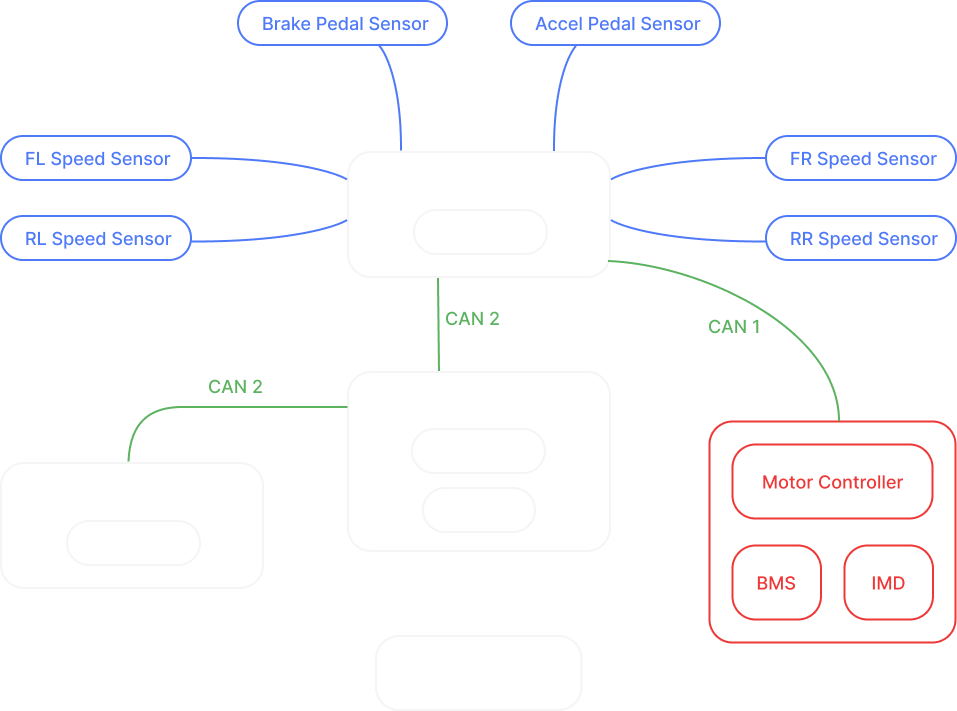

# 2026 - 2027 Season
**1. One year is a surprisingly short time**
**2. Test before committing & make testing easy**
**3. KISS: Keep it simple, Stupid**

## Priorities
### Technical
- Migration to KiCad & GitHub (LV)
    - Centralized library for shared components & Designs
- New LV Architecture
- Wiring CAD
- Finish Accumulator
- Improved HV Boards
### Other
- Early Submits for ESFs etc. [Deadlines](https://www.formula-hybrid.org/deadlines)
- Pre-Event Eletrical Review [Only info found](https://www.formula-hybrid.org/volunteer)
- Sponsors
    - Connectors / harnesses
    - PCB manufacturing
- Read *entire* relevant sections of datasheets

## High Voltage
- IMD: Bender iso165C-1
- BMS: Orion 

### Module Assembly
- **Fuses:** Figure out a new fuse situation. We will have to do a lot of testing on what material to use (copper) and then endurance testing to see if they will become undone under different forces. 
    - In order to test fuses we also need to fix our fuse rig.
- **Thermistors:** Done — they just need to be glued to each module.
- **Spotwelding:** Once we find new fuses, spotweld them to busbars, then spotweld the segment to the cells.
- **Busbars:**
    - Create new thin busbars?
    - We have the materials for thick busbars — just need to bend them and put them into the modules.
- **Thermal bonding:** Bond the thermistors to the thin busbars once they are spotwelded on.
- **BMS testing:** Once the modules are complete, test that we can read temperature data from the Orion BMS 2. Readings were already obtained with code on the BMS expansion boards — we just need to confirm they are accurate for each module.

### Finish the Mid-Box
- **Fix two errors on the TSSI and Precharge boards:**
    - TSSI components need to be galvanically isolated (the connector going from the board to the TSSI lights).
    - Precharge has a logic error that needs to be resolved.
- **TSSI Lights:** Make TSSI lights that actually work.
- **Wiring & documentation:** Finish wiring everything up, then create a schematic of the entire mid-box wiring for documentation purposes.

### Finish Top Cover / Rest of Box
- **Nomex insulation:** Already cut — just need to epoxy it to the walls of the accumulator housing.
- **Top cover insulation:** Either get more insulation paper for the top cover or use polycarbonate (the top cover also needs to be insulated).
- **Top cover components:** A few more things need to be added (HVD, TSMP, etc.). 

## Low Voltage

### Gen 2 System Architecture



### [Details of Projects](gen-2-architecture.md)

#### CAN Buses
- **CAN 1:** PCU — Cascadia
- **CAN 2:** PCU — Dash — CTU - IMD - BMS
- **CAN 3** Dash – Steering Wheel

### Improved practices
- Test points
- 2nd power input path or power over USB on every board
- Central Library Structure
```
FSAE/
├── fsae-kicad-lib/
├── CTU-PCB/
├── PCU-PCB/
├── STM-PCB/
├── Dash-PCB/
└── Steering-PCB/
```

## Timeline
### May:
- Connector companies (sponsor/sample) → move all board designs from dead point
- Contact New Haven Display company
- Confirm allocated space on dashboard and roll hoop
### June:
- STM Core board → first board to make once connectors thing resolved
    - PCBWay Sponsorship
- PCU 
    - filter circuit decision for Gen 2 (can be done without connectors or STM Core)
    - Gen 2 design → after connector + filter circuit decisions
- CTU board design
    - Breadboard testing
    - SMD component sourcing can be done before STM Core
- Dash & Steering wheel Boards
### July:
- Design reviews by Ufuk and Andres
- STM Core & Dev board first to prod (Early July)
- PCU, CTU, Dash ready for prod after Core design locked in (Late July)
### August:
- Wiring 
    - CAD (collaborate with Mechs), Export lengths
    - Lengths & Gauges table
- Enclosure CADs
### Fall Semester:
- Manufacturing
- Testing
- Firmware

