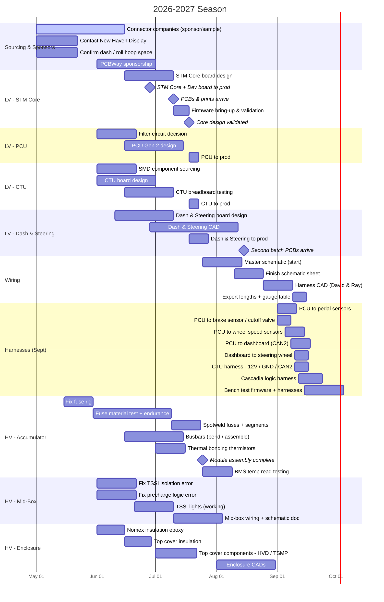

# 2026-2027 Season Timeline

Visual timeline for the season. Rendered with [Mermaid](https://mermaid.js.org/syntax/gantt.html) — displays automatically on GitHub and in Cursor's markdown preview.

> Dates are planning estimates. `after` links encode real dependencies, so shifting one task cascades to the ones that depend on it. See [season-plan.md](season-plan.md) for full detail on each item.

## Legend

- **Milestones** (diamonds): hard checkpoints like parts arriving or a design being validated.
- **`after` dependencies**: e.g. PCU/CTU/Dash go to prod only *after* the STM Core design is validated.
- **Critical path**: Connectors → STM Core → Core validation → all other boards to prod → wiring → harnesses.

## Editing tips

- Add a task: `Task name :id, START_DATE, DURATION` (e.g. `20d`) or `:id, after otherId, 20d`.
- Mark in-progress with `:active,` and done with `:done,` before the id.
- Group related work by adding a new `section`.
